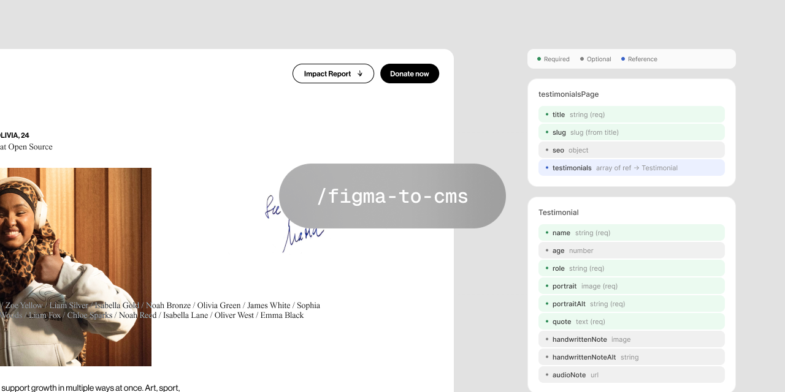

# figma-to-cms



A Claude Code command that analyzes a Figma design frame, classifies content vs decoration (layout agnostic), and proposes a CMS-ready schema. Leverages `use_figma` to annotate the design directly — schema cards sit right next to the frame for instant visual review.

Output is platform-agnostic, ready for any CMS.

## Requirements

- [Claude Code](https://claude.ai/code)
- [Figma MCP server](https://github.com/anthropics/claude-plugins-official/tree/main/figma) connected

## Install

```sh
cp commands/figma-to-cms.md ~/.claude/commands/
```

## Usage

```
/figma-to-cms <figma-url>
```

## What it does

1. Reads a Figma frame via `get_design_context` + `get_screenshot`
2. Classifies every element as content, decorative, or ambiguous
3. Detects patterns — filters, pagination, grouped links, references vs inline
4. Proposes a typed, platform-agnostic schema
5. Scans the canvas for neighboring elements to avoid annotation collisions
6. Leverages `use_figma` to annotate the Figma file with color-coded cards next to the design for visual review

## Annotations

Color-coded cards placed next to the design:

| Color | Meaning |
|-------|---------|
| Green | Content — CMS-managed |
| Grey | Decorative — code only |
| Yellow | Ambiguous — needs decision |
| Blue | Referenced document |

## License

MIT
